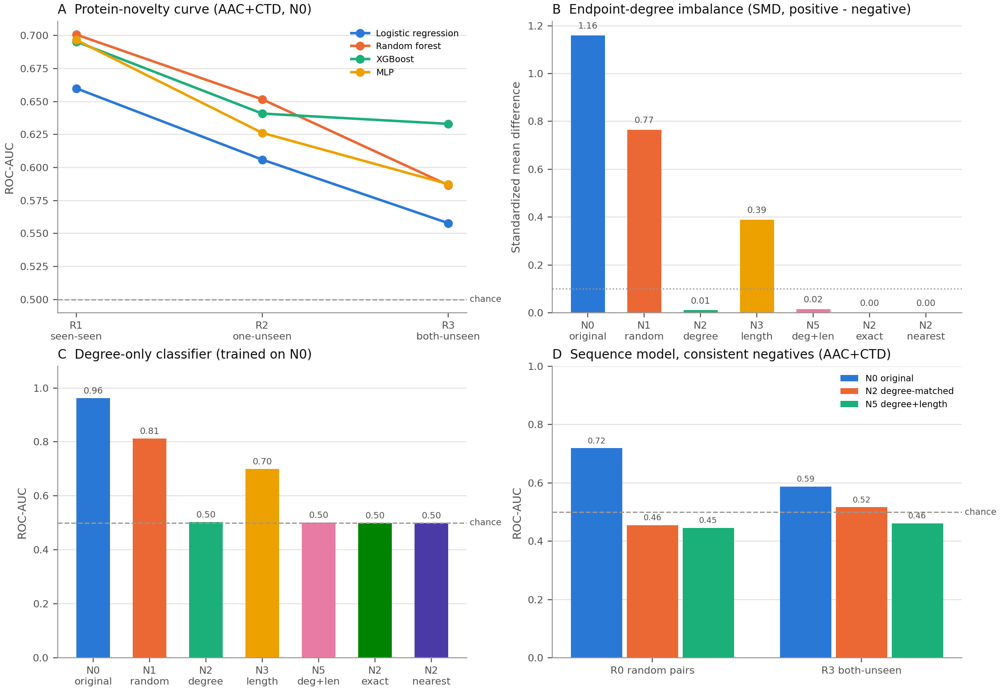

# A framework for Protein-novelty and negative-sampling controls for PPI benchmarks

Code, data splits, constructed negative sets, sample-level predictions, tables and figures
supporting the manuscript:

> **Complementary controls for protein reuse and negative sampling reveal benchmark-specific
> signal in protein–protein interaction prediction.**
> [AUTHORS]. [JOURNAL / PREPRINT, YEAR]. [DOI]

Sequence-based protein–protein interaction (PPI) predictors are usually evaluated on random
pair splits of benchmarks whose negatives are constructed rather than observed. That design
allows two separate problems: the same **proteins recur** in training and test pairs, and
**constructed negatives can differ systematically** from positives in network properties.
This repository audits both mechanisms on the Guo *S. cerevisiae* benchmark and a
three-species benchmark, and provides a single-file tool,
[`ppi_benchmark_controls.py`](ppi_benchmark_controls.py), that applies the same controls to
any PPI dataset.



*Output of `ppi_benchmark_controls.py` on the Guo benchmark. (A) Discrimination falls as test
proteins become unseen. (B) Original negatives (N0) have far lower endpoint degree than
positives; degree-matched sets (N2, N5) remove the gap. (C) A classifier given only endpoint
degree separates the original labels (ROC-AUC 0.96) but not degree-matched negatives (0.50).
(D) Sequence models trained and tested with degree-matched negatives are close to chance.*

---

## Contents

1. [Key findings](#1-key-findings)
2. [Quick start](#2-quick-start)
3. [Input data format](#3-input-data-format)
4. [What the framework does](#4-what-the-framework-does)
5. [Datasets and audit](#5-datasets-and-audit)
6. [Protein and pair representations](#6-protein-and-pair-representations)
7. [Benchmark design](#7-benchmark-design)
8. [Models](#8-models)
9. [Results](#9-results)
10. [Interpretation and scope](#10-interpretation-and-scope)
11. [Reproducing the manuscript](#11-reproducing-the-manuscript)
12. [Repository layout](#12-repository-layout)
13. [Citation, license and data terms](#13-citation-license-and-data-terms)

---

## 1. Key findings

| Question | Result (Guo yeast unless stated) |
|---|---|
| Does performance hold when test proteins are unseen? | No. AAC+CTD–MLP ROC-AUC fell from **0.697** (R1, both proteins seen) to **0.626** (R2, one unseen) and **0.587** (R3, both unseen), with the training set held fixed. |
| Does stricter sequence-identity exclusion lower it further? | Not consistently. R3-50 → R3-20 variants gave ROC-AUC 0.54–0.66 with no monotonic trend. |
| Are the original negatives biased? | Yes. Mean positive-network degree of endpoints: **6.72** for positives vs **3.34** for original negatives (SMD 1.16). |
| Can degree alone reproduce the benchmark? | Yes. A logistic model on four degree summaries reached ROC-AUC **0.962** on original negatives and **0.502** on degree-matched negatives. |
| What do sequence models achieve with degree-matched negatives? | With the negative definition used consistently for training and testing, six architectures scored ROC-AUC **0.493–0.547** at R3. No corrected component-aware test showed any exceeded chance. |
| Is the N0–N2 drop statistically established? | The point-estimate drop (0.08–0.14 ROC-AUC) was consistent across architectures and seeds, but did not reach significance under corrected component-aware tests: the R3 test graphs contain only 19 (N0) and 5 (N2) connected components. |
| Is this specific to Guo? | Partly. A three-species benchmark also showed degree bias (degree-only ROC-AUC 0.849 → 0.535), but sequence models kept some signal after matching (pooled ESM-2–MLP 0.698; within-species 0.567–0.647). Pooled N2 negatives mix species (45.1% cross-species), so part of the pooled signal is taxonomic. |

The reduced Guo discrimination is **benchmark-specific**. It should not be read as a
statement about sequence-based PPI prediction or protein language models in general.

---

## 2. Quick start

```bash
git clone [REPOSITORY URL] && cd [REPOSITORY NAME]
python3 -m venv .venv && source .venv/bin/activate
pip install -r requirements-minimal.txt      # enough for the single-file tool
# full manuscript pipeline: pip install -r requirements.txt (see file for the torch CPU wheel)
```

**1. Synthetic demo (about 1 minute).** Generates a toy benchmark with a planted degree bias
*and* a planted sequence rule, then runs every control:

```bash
python ppi_benchmark_controls.py demo --out outputs/demo
```

In the demo, degree-only ROC-AUC falls from ~0.98 to ~0.51 after degree matching, while the
sequence model keeps ~0.71 at R3. This is the pattern the framework is designed to separate
from the Guo pattern, where both collapse.

**2. Guo yeast benchmark (about 2 minutes on a multi-core workstation with AAC+CTD; `--quick` is faster).**
This reproduces the manuscript's splits, negative sets and headline numbers exactly:

```bash
python ppi_benchmark_controls.py run \
    --proteins data/raw/yeast/dictionary/protein.dictionary.tsv \
    --pairs    data/raw/yeast/actions/protein.actions.tsv \
    --out      outputs/guo_yeast
```

Add the bundled ESM-2 embeddings and the 20%-identity MMseqs2 clusters (adds the R3-C split):

```bash
python ppi_benchmark_controls.py run \
    --proteins data/raw/yeast/dictionary/protein.dictionary.tsv \
    --pairs    data/raw/yeast/actions/protein.actions.tsv \
    --embeddings embeddings/esm2/protein_embeddings.h5 --embeddings-name "ESM-2 mean" \
    --clusters data/processed/clusters/cluster_20.tsv \
    --out outputs/guo_yeast_esm2
```

This takes about 7 minutes on the same machine; its output (report, tables, figures) is committed in [`example_outputs/guo_yeast/`](example_outputs/guo_yeast/REPORT.md).

**3. Your own data.**

```bash
python ppi_benchmark_controls.py validate --proteins my_proteins.fasta --pairs my_pairs.tsv --out outputs/check
python ppi_benchmark_controls.py run      --proteins my_proteins.fasta --pairs my_pairs.tsv --out outputs/mine
python ppi_benchmark_controls.py run ... --esm2        # compute frozen ESM-2 embeddings (needs torch + transformers)
```

| Option | Meaning |
|---|---|
| `--models lr,rf,xgb,mlp` | Models for the novelty curve (default: all; XGBoost is skipped if not installed) |
| `--embeddings FILE` | Extra per-protein representation (`.csv`, `.tsv`, `.npz` or `.h5`) |
| `--embeddings-name NAME` | Label for that representation in tables and figures |
| `--esm2 [MODEL]` | Compute frozen mean-pooled ESM-2 embeddings (default `facebook/esm2_t12_35M_UR50D`) |
| `--clusters FILE` | Protein → sequence-cluster table; adds a cluster-disjoint R3-C split |
| `--seed 42` | Seed for splits, negative sampling and models |
| `--n-boot 2000` | Component-bootstrap replicates |
| `--quick` | LR + MLP only, 200 bootstrap replicates, no exact/nearest N2 variants |

Run `pytest` to execute the test suite (185 tests, about 2 minutes), including checks that
the single-file tool regenerates the saved Guo splits and N2 negatives.

---

## 3. Input data format

**Proteins** (`--proteins`): FASTA, or a TSV/CSV with two columns. The header is optional.

```
protein_id	sequence
P53049	MSTQKLSEG...
Q08949	MADLNKKRE...
```

**Pairs** (`--pairs`): TSV/CSV with `protein_a`, `protein_b` and an optional `label`
(1 = observed interaction, 0 = supplied constructed negative). The header is optional.

```
protein_a	protein_b	label
P53049	P09435	1
P38089	Q08949	1
P40484	Q04792	0
```

- Pairs are undirected. Order, duplicates, reversed duplicates and self-pairs are handled
  by the audit.
- **Without a `label` column** (or with no `0` rows) every pair is treated as positive. The
  tool then builds all negatives itself and uses random negatives (N1) as the reference set.
- Every identifier in the pair file must appear in the protein file. Non-standard residues
  (X, U, B, Z) are reported, then removed before descriptor computation.

**Clusters** (`--clusters`, optional): `protein_id<TAB>cluster_id` with a header, or the
headerless `representative<TAB>member` file written by `mmseqs easy-cluster`. The command
used in the manuscript:

```bash
mmseqs easy-cluster proteins.fasta clu tmp --min-seq-id 0.2 -c 0.8 --cov-mode 0 \
    --cluster-mode 0 -s 4.0 --seq-id-mode 0      # then pass clu_cluster.tsv
```

**Embeddings** (`--embeddings`, optional): one vector per protein.

| Format | Layout |
|---|---|
| `.csv` / `.tsv` | first column `protein_id`, remaining columns numeric |
| `.npz` | arrays `ids` (n) and `X` (n × d) |
| `.h5` | datasets `protein_id` and `mean` (or another name passed with `--embeddings-dataset`), as in `embeddings/esm2/protein_embeddings.h5` |

A complete synthetic example is in [`example_data/synthetic/`](example_data/synthetic/)
(`proteins.tsv`, `pairs.tsv`, plus `hidden_types.tsv`, which holds the planted ground truth).

**Outputs** (`--out`):

```
REPORT.md                      one-page report with key diagnostics, tables and figures
audit.json, canonical_pairs.tsv
splits/<R0|R1|R2|R3|R3-C>/{train,test}.tsv
negatives/<N0|N1|N2|N3|N5|N2-exact|N2-nearest>.tsv
tables/  split_summary, negative_set_balance, novelty_curve_metrics, topology_controls,
         consistent_negative_revalidation, component_aware_uncertainty, protein_statistics (.csv)
predictions/sample_level_predictions.csv.gz
figures/ 00_framework_summary … 06_component_uncertainty (.png)
```

---

## 4. What the framework does

```
 proteins + pairs
        │
 1. Audit & canonicalize ── duplicates, reversed duplicates, self-pairs, label conflicts,
        │                   identical-sequence groups, positive-graph statistics
 2. Negative sets ───────── N1 random · N2 degree-matched · N3 length-matched ·
        │                   N5 degree+length · N2-exact · N2-nearest; endpoint balance (SMD, KS, W1)
 3. Splits + leakage gates ─ R0 random pairs · R1/R2/R3 matched novelty curve ·
        │                   R3-C cluster-disjoint (optional); pair/protein/group/cluster overlap checks
 4. Representations ─────── AAC+CTD (167-d) · optional embedding · symmetric pair fusion
 5. Novelty curve ───────── LR / RF / XGBoost / MLP on R0–R3 (original negatives)
 6. Negative controls ───── degree-only and length-only classifiers (trained on N0, tested on
        │                   each set); sequence MLP with consistent N0/N2/N5 at R0 and R3
 7. Graph-aware uncertainty  connected-component bootstrap + delete-one-component jackknife,
                            Benjamini–Hochberg adjustment
```

The single-file tool reimplements the core of `src/` with the same algorithms and default
settings. On the Guo data it reproduces the saved R0–R3 splits and the N2/N3/N5 negative
sets byte for byte, and matches the manuscript's values (R1/R2/R3 MLP 0.697/0.626/0.587;
degree-only 0.962 → 0.502; R3/N2 AAC+CTD 0.517). One deliberate difference: its N1 sampler
does not depend on Python's hash seed, so its N1 set (and N1 numbers, e.g. degree-only 0.813
vs 0.809) differs slightly from the saved file. Architecture comparisons, calibration,
multi-seed and multi-species analyses are in the full pipeline (Section 11).

---

## 5. Datasets and audit

### Guo *S. cerevisiae* benchmark (primary)

Guo *et al.* (2008), `data/raw/yeast/`: 2,497 proteins and 11,188 labelled pairs (5,594 per class).

| Audit item | Result |
|---|---|
| Missing sequences, invalid residues, self-pairs, conflicting labels | none |
| Duplicate pairs removed after canonical ordering | 24 (13 positive, 11 negative) |
| Canonical pairs | 11,164: 5,581 positive, 5,583 constructed negative |
| Identical-sequence groups | 3 groups, 8 identifiers (kept on one side of every split) |
| Positive graph | 2,217 nodes, 5,581 edges, mean degree 5.03, max 15, 98 components (largest 1,631) |
| Proteins with no observed positive partner | 280 |
| Sequences longer than 1,022 residues (ESM-2 limit) | 268 (10.7%) |
| Originally supplied train/test split | every test protein also occurs in training |

### Multi-species benchmark (specificity check)

`data/raw/multi_species/`: 11,529 proteins and 64,103 canonical pairs (31,678 positive)
from *C. elegans*, *D. melanogaster* and *E. coli*. Taxonomy was resolved from UniProtKB,
UniSave and NCBI records (`data/external/multi_species_taxonomy/species_assignments.tsv`).
30 proteins belonged to other organisms and 6 remained unresolved.

| Species | Proteins | Pairs | Positive / original negative |
|---|---|---|---|
| *C. elegans* | 2,629 | 7,864 | 3,950 / 3,914 |
| *D. melanogaster* | 7,041 | 42,788 | 21,742 / 21,046 |
| *E. coli* | 1,823 | 12,861 | 5,907 / 6,954 |

---

## 6. Protein and pair representations

Each protein is encoded independently of its partner; pairs are built afterwards.

| Representation | Dimensions | Notes |
|---|---|---|
| AAC | 20 | amino-acid composition |
| CTD | 147 | composition / transition / distribution over 7 physicochemical groupings |
| **AAC+CTD** | 167 | principal handcrafted representation |
| Physicochemical (ProtParam) | 8 | evaluated separately in the five-fold baseline only |
| **ESM-2 mean / CLS** | 480 | frozen `facebook/esm2_t12_35M_UR50D`; first 1,022 residues; no fine-tuning |
| ProtT5 mean | 768 | frozen `Rostlab/prot_t5_base_mt_uniref50`; limited cross-check only |
| Degree-only / length-only | 4 | sum, \|difference\|, min, max of endpoint positive degree or length (controls) |

**Pair fusion.** Primary features are symmetric by construction:
`[hA + hB, |hA − hB|, hA ⊙ hB]`, so f(A, B) = f(B, A). Sum, absolute difference, Hadamard
product, a learned symmetric operator and order-sensitive concatenation were compared in the
fusion ablation. Endpoint-swap tests check invariance.

Cached representations: `data/processed/features/` (AAC, CTD, physicochemical),
`embeddings/esm2/`, `embeddings/prott5/`, `embeddings/esm2_multi_species/`,
`embeddings/esm2_truncation_variants/`.

---

## 7. Benchmark design

### Evaluation regimes (protein novelty)

| Regime | Test pairs contain | Construction | Guo train / test pairs |
|---|---|---|---|
| R0 | proteins may recur freely | stratified 80/20 random pair split (independent reference) | 8,931 / 2,233 |
| R1 | two proteins seen in training | degree-safe holdout from the train pool | 5,703 / 1,426 |
| R2 | exactly one unseen protein | mixed train-pool / test-pool pairs | 5,703 / 3,570 |
| R3 | two unseen proteins | both endpoints in the test pool | 5,703 / 462 |
| R3-50 … R3-20 | two unseen proteins, no shared MMseqs2 cluster | clusters (not proteins) assigned to pools | 7,043–7,227 / 419–450 |

R1–R3 come from **one** partition of identical-sequence groups into protein pools and share a
single training set, so they form a matched novelty curve. R0 and the R3-τ variants are
sampled independently. Every split passes automated gates (exact-pair, reversed-pair,
protein, sequence-group and cluster overlap, and label integrity) before it is written.

### Constructed (putative) negative sets

| Set | Definition |
|---|---|
| N0 | the benchmark's original negatives |
| N1 | uniformly random unobserved pairs |
| N2 | one-sided substitution: one endpoint of each positive replaced by a protein from the same **degree** decile |
| N3 | as N2, matched on **sequence-length** decile |
| N5 | as N2, matched on degree **and** length |
| N6 | two-sided degree-matched substitution |
| N7 | N5 plus within-pair exclusion of shared 20%-identity clusters |
| N2-exact / N2-nearest | exact-degree or nearest-degree matching instead of deciles |

Candidates that would recreate a known positive (in either order), form a self-pair or
duplicate an existing negative are rejected. If no candidate qualifies, the negative is
omitted rather than the rule relaxed. For R3, negatives are sampled separately inside the
train and test protein pools, and disjointness is re-checked. These are *putative*
negatives, not experimentally established non-interactions.

### Training/evaluation designs

- **Design A:** train on N0, replace the test negatives with N1/N2/N3/N5.
- **Design B:** train on each negative set, test on the common N0 test set.
- **Consistent-negative revalidation:** the same negative definition for training and testing, at R0 and R3.

### Metrics and inference

ROC-AUC and PR-AUC (average precision) are primary. MCC, balanced accuracy, F1, precision,
recall and specificity use a fixed 0.5 threshold that is never tuned on test data. Brier
score, ECE (with bin sensitivity), and Platt/isotonic calibration fitted on
training-derived data are also reported. Test pairs sharing proteins are dependent, so
uncertainty resamples **connected components of the test-pair graph**: a percentile
bootstrap (2,000 replicates) and a delete-one-component jackknife with a t reference.
Benjamini–Hochberg correction is applied within each method's 44-test family. Model seeds
(5) and negative-generation seeds (30) are reported as algorithmic stability on the same
graph, not as independent biological replication.

---

## 8. Models

| Model | Settings |
|---|---|
| Logistic regression | L2, C = 1, max 2,000 iterations |
| Random forest | 300 trees (degree/length controls: 200 trees, depth 6) |
| XGBoost | 300 estimators, log-loss |
| MLP (scikit-learn) | 128–64 ReLU, Adam, max 500 iterations, early stopping |
| Siamese network | shared encoder 256 → 128, symmetric sum, 64-unit head |
| Attention fusion | single-head attention over the two protein tokens, 128-d Q/K/V |
| Cross-interaction | low-rank product of shared 128-d projections + sum and \|difference\| |

Neural architectures (`src/models/`) use Adam (lr 10⁻³), batch 128, up to 100 epochs, and
early stopping (patience 10) on a 15% validation subset drawn from training data. Features are
standardized on training data only. No per-condition hyperparameter search and no class
weighting were used.

---

## 9. Results

All values are ROC-AUC unless stated. Full tables: `tables/` (see `docs/PROVENANCE.md`).

**Protein novelty (AAC+CTD, original negatives; Table S23).**

| Model | R0 | R1 | R2 | R3 | R3-50 | R3-40 | R3-30 | R3-20 |
|---|---|---|---|---|---|---|---|---|
| Logistic regression | 0.640 | 0.660 | 0.606 | 0.558 | 0.608 | 0.618 | 0.556 | 0.610 |
| Random forest | 0.684 | 0.701 | 0.652 | 0.587 | 0.630 | 0.641 | 0.576 | 0.660 |
| XGBoost | 0.676 | 0.695 | 0.641 | 0.633 | 0.583 | 0.587 | 0.554 | 0.625 |
| MLP | 0.701 | 0.697 | 0.626 | 0.587 | 0.584 | 0.586 | 0.544 | 0.586 |

**Representation (shared MLP; Table S24).** R0: ESM-2 CLS 0.755, ESM-2 mean 0.730, AAC+CTD 0.701.
R3: 0.562, 0.617 and 0.587. Rankings change across the R3-τ variants, so neither pooling
choice has a uniform advantage.

**Degree-only control (trained on N0; Tables S7, S34).**

| Test negatives | N0 | N1 | N3 | N2 (decile) | N2 exact | N2 nearest | N5 |
|---|---|---|---|---|---|---|---|
| Degree-only LR | 0.962 | 0.809 | 0.700 | 0.502 | 0.499 | 0.499 | 0.501 |
| Length-only LR | 0.540 | 0.511 | 0.509 | 0.506 | – | – | 0.509 |

**Sequence models with consistent negatives (MLP; Table S17).**

| | R0/N0 | R0/N2 | R0/N5 | R3/N0 | R3/N2 | R3/N5 |
|---|---|---|---|---|---|---|
| AAC+CTD | 0.720 | 0.455 | 0.446 | 0.587 | 0.517 | 0.462 |
| ESM-2 mean | 0.754 | 0.463 | 0.463 | 0.617 | 0.517 | 0.507 |

**Architectures at R3 (ESM-2; Tables S4, S14).** N0: 0.604–0.651. N2: logistic regression 0.500,
random forest 0.518, MLP 0.517, Siamese 0.512, attention fusion 0.547, cross-interaction
0.493. Five-seed N2 means: 0.500–0.525. After Benjamini–Hochberg correction no architecture
exceeded chance under N2 with either resampling method. N0–N2 differences of 0.077–0.139
had adjusted P = 0.130–0.492 (bootstrap) and 0.674–0.999 (jackknife) (Table S41).

**Robustness.** Across 30 N2 generation seeds, R3 ESM-2–MLP was 0.505 ± 0.023 (Table S8).
Training-only degrees left R0/N2 below 0.5 (Table S9). Truncation strategy changed R3
ESM-2–MLP by < 0.01 (Table S16). Calibration improved some probability metrics but not MCC
consistently (Tables S13, S38–S39).

**Multi-species benchmark (Tables S21, S27–S29, S32–S33).**

| | Degree-only LR, N0 → N2 | ESM-2–MLP, N0 → N2 | ESM-2–MLP, N2 exact / nearest |
|---|---|---|---|
| Pooled | 0.849 → 0.535 | 0.981 → 0.698 | – |
| *C. elegans* | 0.868 → 0.583 | 0.983 → 0.596 | 0.574 / 0.570 |
| *D. melanogaster* | 0.830 → 0.536 | 0.985 → 0.567 | 0.560 / 0.559 |
| *E. coli* | 0.951 → 0.583 | 0.977 → 0.647 | 0.612 / 0.596 |

In the pooled N2 set, 45.1% of negatives join proteins from different species, and a
same-species indicator alone scores 0.729.

---

## 10. Interpretation and scope

- **Protein novelty and negative construction are distinct problems.** A protein-disjoint
  split can keep a biased negative set, and a degree-balanced negative set can still let
  proteins recur. Both need to be controlled and reported.
- **In Guo, endpoint degree is sufficient to reproduce most of the original label
  separation.** This shows sufficiency within a retrospective benchmark. It does not show
  that sequence models use degree internally, or that degree is the sole cause. Degree is
  computed from the same incomplete positive graph that supplies the labels, so annotation
  density, study bias and detectability may covary with it.
- **Near-chance R3/N2 estimates are not evidence of no signal.** Non-significant tests do
  not establish equivalence to chance, and small numbers of test components limit inference.
- **Results do not generalize automatically.** The second benchmark kept modest
  within-species signal after matching, although those splits allowed protein recurrence.
- **Degree matching is a diagnostic, not a deployment protocol.** Full-graph degree is not
  available for a protein with no known interactions.

When applying `ppi_benchmark_controls.py` to a new dataset, the report flags: (i) a large
degree SMD between positives and supplied negatives; (ii) a degree-only ROC-AUC well above
chance; (iii) a drop from R1 to R3; (iv) whether sequence-model performance survives
consistent degree-matched negatives; and (v) how few connected components the test graph
contains.

---

## 11. Reproducing the manuscript

All intermediate outputs are committed, so any step can be rerun on its own. Scripts read
from and write to the repository tree. The order below regenerates everything from the raw data.

| Step | Scripts |
|---|---|
| Environment, audit, canonicalization | `00_setup_environment.py`, `01_audit_dataset.py`, `02_canonicalize_pairs.py` |
| MMseqs2 clustering and splits | `00b_install_mmseqs2.sh`, `03_cluster_sequences.py`, `04_generate_splits.py`, `44_split_integrity_audit.py` |
| Features and embeddings | `05_extract_handcrafted_features.py`, `06_extract_plm_embeddings.py`, `19_extract_prott5_embeddings.py` |
| Baselines, novelty and representation | `07`–`10` |
| Negative sets and topology controls | `11`, `14`, `24`–`27`, `32`–`34`, `37`, `38` |
| Architectures, statistics, calibration | `15`–`18`, `20`, `28`–`31`, `35`, `45` |
| Figures | `22`, `46` |
| Multi-species | `39`–`43`; taxonomy `48` (needs network access), `50`; within-species `49` |
| Reporting tables | `scripts/manuscript_reporting/` (see its README) |

On a CPU, the slowest steps are the embeddings: about 12 min for ESM-2 on Guo, 25 min for
ProtT5, and 60 min for ESM-2 on the multi-species set. The committed caches let you skip them.

```bash
pip install -r requirements.txt
pip install torch==2.13.0 --index-url https://download.pytorch.org/whl/cpu
pip install -e .
bash scripts/00b_install_mmseqs2.sh           # MMseqs2 build 8cc5ce36… into tools/
python scripts/01_audit_dataset.py            # ... and so on, in numerical order
pytest
```

Every seed is 42 unless a script states otherwise. The original runs used Python 3.10 on
Linux, CPU only (`results/environment_report.json`, `results/software_versions.csv`).
[`docs/PROVENANCE.md`](docs/PROVENANCE.md) maps every figure and Supplementary Table
S1–S45 to its file and script. [`docs/RESULTS_INDEX.md`](docs/RESULTS_INDEX.md) maps
`results/` directories to manuscript sections.

---

## 12. Repository layout

```
ppi_benchmark_controls.py   single-file framework (demo / run / validate)
example_data/synthetic/     toy input in the documented format
example_outputs/guo_yeast/  committed output of the tool on the Guo benchmark
src/                        library: data (splits, negatives, leakage checks), features, models, evaluation
scripts/                    numbered analysis pipeline (00–50); manuscript_reporting/ table assembly
configs/                    YAML settings for data, splits, baselines, embeddings, negatives
data/raw/                   Guo yeast and multi-species benchmarks as distributed
data/processed/             canonical pairs, sequence groups, MMseqs2 clusters, features, negative sets
data/splits/                R0–R3 and R3-50…R3-20 train/test files
data/external/              species assignments and taxonomy audit for the multi-species benchmark
embeddings/                 frozen ESM-2, ProtT5 and truncation-variant embeddings (HDF5)
results/                    per-experiment metrics and sample-level predictions
tables/                     all tables (Supplementary Tables S1–S45 and intermediates)
figures/                    main-text Figures 1–12 and Figure S1
docs/                       provenance and results index
tests/                      pytest suite
```

---

## 13. Citation, license and data terms

If you use this code or the controls, please cite the manuscript above ([CITATION TO BE ADDED]).

- **Code license:** [OSI-APPROVED LICENSE — TO BE ADDED BY AUTHORS]
- **Archive:** [RELEASE TAG / ZENODO DOI]
- **Data:** the Guo yeast benchmark (Guo *et al.*, 2008, *Nucleic Acids Res.* 36:3025) and
  the multi-species benchmark are redistributed for reproducibility and remain subject to
  their original terms. Taxonomy annotations derive from UniProtKB and NCBI.

**References.** Guo *et al.* (2008) *Nucleic Acids Res.* 36:3025 · Park & Marcotte (2012)
*Nat. Methods* 9:1134 · Lin *et al.* (2023) *Science* 379:1123 · Elnaggar *et al.* (2021)
*IEEE TPAMI* · Steinegger & Söding (2017) *Nat. Biotechnol.* 35:1026 · Li *et al.* (2025)
*BMC Biol.* 23:123 · Chatterjee *et al.* (2025) *Bioinformatics* 41:btaf148 · Bernett
*et al.* (2024) *Brief. Bioinform.* 25:bbae076.
