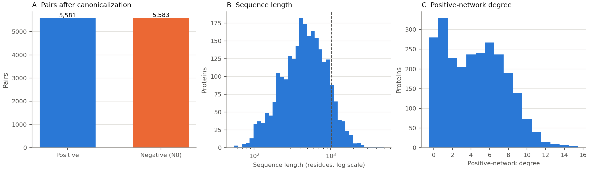
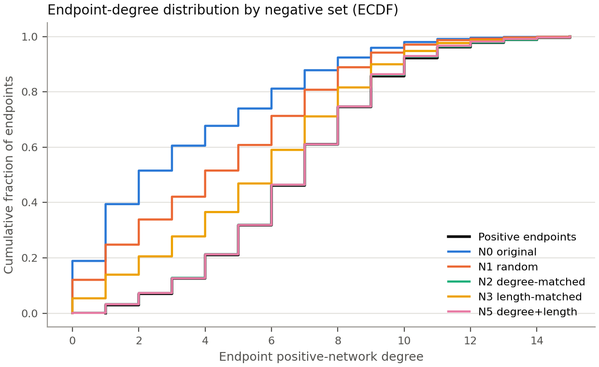
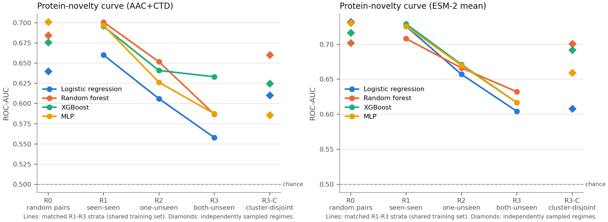
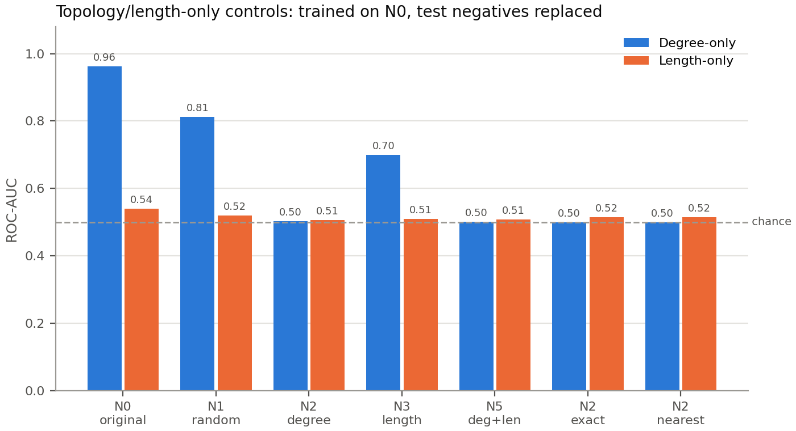
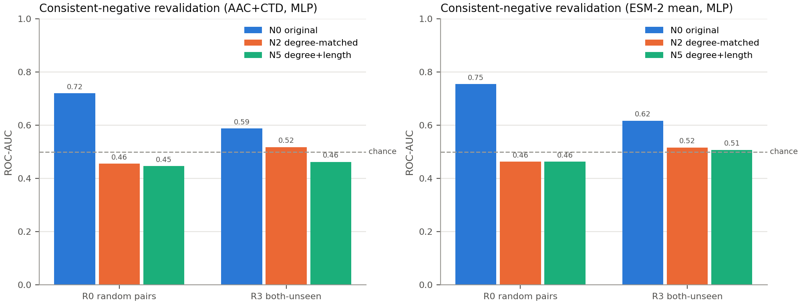
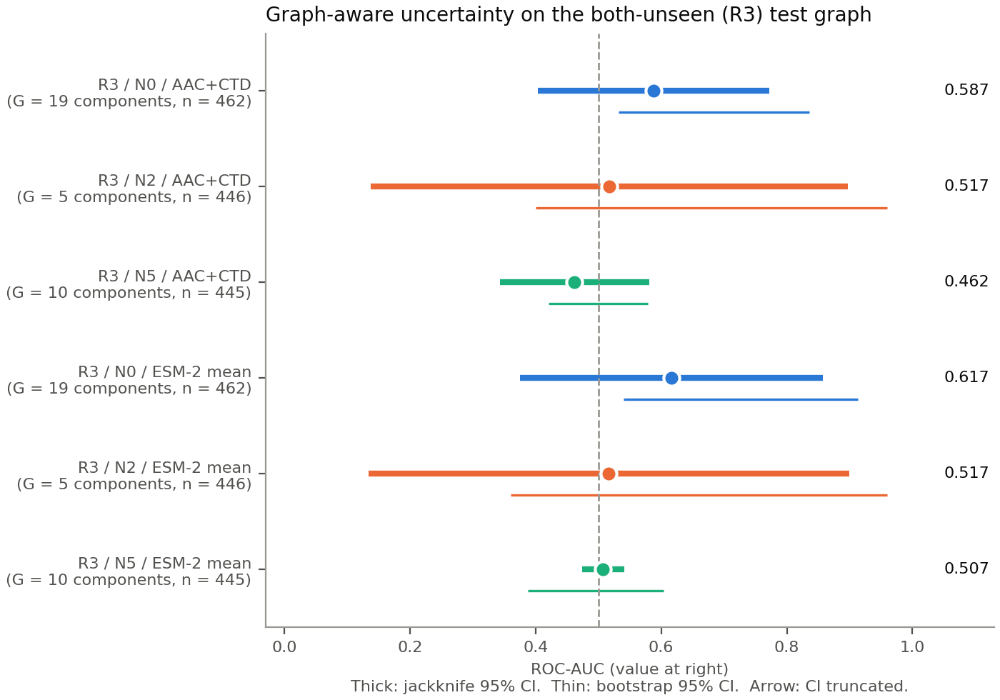

# PPI benchmark-control report

Generated by `ppi_benchmark_controls.py` v1.0.0 (seed 42, 425 s).
Representations: AAC+CTD, ESM-2 mean. Models: Logistic regression, Random forest, XGBoost, MLP.

## Key diagnostics

- **Degree imbalance in supplied negatives.** Positive endpoints have mean degree 6.72 versus 3.34 for supplied negatives (SMD 1.16).
- **Degree alone separates the supplied labels** (degree-only ROC-AUC 0.962); it falls to 0.502 on degree-matched N2 negatives.
- **Discrimination falls with protein novelty** (MLP ROC-AUC 0.697 at R1 to 0.587 at R3).
- **Consistent degree-matched negatives at R3: sequence-model point estimate close to chance** (ROC-AUC 0.517; N0 0.587). See Section 7 for component-aware intervals.
- **Few independent test units:** R3 test graphs contain 5-19 connected components; interpret intervals and tests accordingly.

These are descriptive diagnostics on one dataset. Constructed negatives are putative
(unobserved) pairs, not experimentally established non-interactions; full-graph degree
is a retrospective audit feature, not a prospective input.

## 1. Dataset audit

| Quantity | Value |
|---|---|
| Input proteins / pairs | 2,497 / 11,188 |
| Canonical pairs (positive / negative) | 11,164 (5,581 / 5,583) |
| Duplicate pairs removed (exact + reversed) | 24 |
| Self-pairs / conflicting labels removed | 0 / 0 |
| Identical-sequence groups (size > 1) | 3 |
| Proteins with zero positive degree | 280 |
| Sequences longer than 1022 residues | 268 |
| Positive graph: nodes / edges / components / largest | 2,217 / 5,581 / 98 / 1,631 |

## 2. Negative-set balance

Endpoint-occurrence statistics (each pair contributes two endpoints). SMD is positive minus negative.

| negative_set | n_negatives | positives_without_negative | positive_mean | negative_mean | smd | ks_statistic | wasserstein | length_smd |
|---|---|---|---|---|---|---|---|---|
| N0 | 5,583 | 0 | 6.724 | 3.342 | 1.160 | 0.480 | 3.383 | 0.043 |
| N1 | 5,581 | 0 | 6.724 | 4.452 | 0.765 | 0.305 | 2.273 | 0.026 |
| N2 | 5,581 | 0 | 6.724 | 6.695 | 0.011 | 0.005 | 0.031 | -0.009 |
| N3 | 5,581 | 0 | 6.724 | 5.573 | 0.390 | 0.155 | 1.152 | 0.005 |
| N5 | 5,581 | 0 | 6.724 | 6.683 | 0.015 | 0.007 | 0.041 | -0.001 |
| N2-exact | 5,581 | 0 | 6.724 | 6.724 | 0.000 | 0.000 | 0.000 | 0.011 |
| N2-nearest | 5,581 | 0 | 6.724 | 6.724 | 0.000 | 0.000 | 0.000 | 0.011 |

## 3. Splits and leakage gates

R1-R3 share one training set (matched protein-novelty curve); R0 is an independent random pair split.

| regime | train_pairs | test_pairs | train_proteins | test_proteins | protein_overlap | reversed_pair_overlap | test_components | passed |
|---|---|---|---|---|---|---|---|---|
| R0 | 8,931 | 2,233 | 2,497 | 2,080 | 2,080 | 0 | 97 | 1 |
| R1 | 5,703 | 1,426 | 1,997 | 1,561 | 1,561 | 0 | 178 | 1 |
| R2 | 5,703 | 3,570 | 1,997 | 2,164 | 1,667 | 0 | 2 | 1 |
| R3 | 5,703 | 462 | 1,997 | 420 | 0 | 0 | 19 | 1 |
| R3-C | 7,043 | 445 | 1,996 | 420 | 0 | 0 | 22 | 1 |

## 4. Protein-novelty curve (original negatives)

| representation | regime | model | test_pairs | roc_auc | pr_auc | mcc |
|---|---|---|---|---|---|---|
| AAC+CTD | R0 | lr | 2,233 | 0.640 | 0.615 | 0.212 |
| AAC+CTD | R0 | rf | 2,233 | 0.684 | 0.655 | 0.291 |
| AAC+CTD | R0 | xgb | 2,233 | 0.676 | 0.651 | 0.252 |
| AAC+CTD | R0 | mlp | 2,233 | 0.701 | 0.680 | 0.310 |
| AAC+CTD | R1 | lr | 1,426 | 0.660 | 0.653 | 0.253 |
| AAC+CTD | R1 | rf | 1,426 | 0.701 | 0.685 | 0.321 |
| AAC+CTD | R1 | xgb | 1,426 | 0.695 | 0.688 | 0.279 |
| AAC+CTD | R1 | mlp | 1,426 | 0.697 | 0.684 | 0.305 |
| AAC+CTD | R2 | lr | 3,570 | 0.606 | 0.569 | 0.150 |
| AAC+CTD | R2 | rf | 3,570 | 0.652 | 0.603 | 0.218 |
| AAC+CTD | R2 | xgb | 3,570 | 0.641 | 0.595 | 0.199 |
| AAC+CTD | R2 | mlp | 3,570 | 0.626 | 0.587 | 0.191 |
| AAC+CTD | R3 | lr | 462 | 0.558 | 0.523 | 0.109 |
| AAC+CTD | R3 | rf | 462 | 0.587 | 0.523 | 0.136 |
| AAC+CTD | R3 | xgb | 462 | 0.633 | 0.597 | 0.198 |
| AAC+CTD | R3 | mlp | 462 | 0.587 | 0.549 | 0.129 |
| AAC+CTD | R3-C | lr | 445 | 0.610 | 0.544 | 0.168 |
| AAC+CTD | R3-C | rf | 445 | 0.660 | 0.591 | 0.234 |
| AAC+CTD | R3-C | xgb | 445 | 0.625 | 0.550 | 0.217 |
| AAC+CTD | R3-C | mlp | 445 | 0.586 | 0.506 | 0.096 |
| ESM-2 mean | R0 | lr | 2,233 | 0.732 | 0.710 | 0.346 |
| ESM-2 mean | R0 | rf | 2,233 | 0.702 | 0.677 | 0.302 |
| ESM-2 mean | R0 | xgb | 2,233 | 0.716 | 0.705 | 0.322 |
| ESM-2 mean | R0 | mlp | 2,233 | 0.730 | 0.716 | 0.356 |
| ESM-2 mean | R1 | lr | 1,426 | 0.726 | 0.724 | 0.346 |
| ESM-2 mean | R1 | rf | 1,426 | 0.708 | 0.708 | 0.312 |
| ESM-2 mean | R1 | xgb | 1,426 | 0.729 | 0.731 | 0.335 |
| ESM-2 mean | R1 | mlp | 1,426 | 0.726 | 0.717 | 0.341 |
| ESM-2 mean | R2 | lr | 3,570 | 0.657 | 0.631 | 0.216 |
| ESM-2 mean | R2 | rf | 3,570 | 0.666 | 0.632 | 0.234 |
| ESM-2 mean | R2 | xgb | 3,570 | 0.671 | 0.644 | 0.249 |
| ESM-2 mean | R2 | mlp | 3,570 | 0.670 | 0.640 | 0.240 |
| ESM-2 mean | R3 | lr | 462 | 0.604 | 0.550 | 0.170 |
| ESM-2 mean | R3 | rf | 462 | 0.632 | 0.588 | 0.204 |
| ESM-2 mean | R3 | xgb | 462 | 0.617 | 0.590 | 0.152 |
| ESM-2 mean | R3 | mlp | 462 | 0.617 | 0.573 | 0.149 |
| ESM-2 mean | R3-C | lr | 445 | 0.608 | 0.556 | 0.170 |
| ESM-2 mean | R3-C | rf | 445 | 0.701 | 0.635 | 0.300 |
| ESM-2 mean | R3-C | xgb | 445 | 0.692 | 0.650 | 0.302 |
| ESM-2 mean | R3-C | mlp | 445 | 0.659 | 0.604 | 0.173 |

## 5. Topology-only and length-only controls

Trained on N0; the test negatives are replaced by each alternative set.

| feature | evaluated_on | roc_auc | pr_auc | mcc |
|---|---|---|---|---|
| degree | N0 | 0.962 | 0.965 | 0.779 |
| degree | N1 | 0.813 | 0.771 | 0.486 |
| degree | N2 | 0.502 | 0.505 | 0.019 |
| degree | N3 | 0.700 | 0.650 | 0.333 |
| degree | N5 | 0.501 | 0.502 | 0.029 |
| degree | N2-exact | 0.499 | 0.500 | 0.026 |
| degree | N2-nearest | 0.499 | 0.500 | 0.026 |
| length | N0 | 0.540 | 0.532 | 0.064 |
| length | N1 | 0.520 | 0.517 | 0.028 |
| length | N2 | 0.506 | 0.509 | 0.019 |
| length | N3 | 0.509 | 0.513 | 0.020 |
| length | N5 | 0.509 | 0.512 | 0.012 |
| length | N2-exact | 0.516 | 0.515 | 0.024 |
| length | N2-nearest | 0.516 | 0.515 | 0.024 |

## 6. Consistent-negative revalidation (MLP)

The same negative definition is used for training and testing. R3 negatives are sampled
within the train or test protein pool, so protein disjointness is preserved.

| representation | regime | negative_set | train_pairs | test_pairs | roc_auc | pr_auc | mcc |
|---|---|---|---|---|---|---|---|
| AAC+CTD | R0 | N0 | 8,930 | 2,234 | 0.720 | 0.691 | 0.329 |
| AAC+CTD | R3 | N0 | 5,703 | 462 | 0.587 | 0.549 | 0.129 |
| AAC+CTD | R0 | N2 | 8,928 | 2,234 | 0.455 | 0.464 | -0.061 |
| AAC+CTD | R3 | N2 | 5,738 | 446 | 0.517 | 0.528 | -0.054 |
| AAC+CTD | R0 | N5 | 8,928 | 2,234 | 0.446 | 0.464 | -0.074 |
| AAC+CTD | R3 | N5 | 5,738 | 445 | 0.462 | 0.477 | -0.015 |
| ESM-2 mean | R0 | N0 | 8,930 | 2,234 | 0.754 | 0.744 | 0.381 |
| ESM-2 mean | R3 | N0 | 5,703 | 462 | 0.617 | 0.573 | 0.149 |
| ESM-2 mean | R0 | N2 | 8,928 | 2,234 | 0.463 | 0.466 | -0.072 |
| ESM-2 mean | R3 | N2 | 5,738 | 446 | 0.517 | 0.505 | 0.009 |
| ESM-2 mean | R0 | N5 | 8,928 | 2,234 | 0.463 | 0.473 | -0.070 |
| ESM-2 mean | R3 | N5 | 5,738 | 445 | 0.507 | 0.506 | 0.007 |

## 7. Component-aware uncertainty (R3)

Test pairs are grouped into connected components of the test-pair graph; whole components
are resampled (percentile bootstrap) or deleted one at a time (jackknife, t reference).
P values test ROC-AUC = 0.5 and are Benjamini-Hochberg adjusted within each method.

| representation | negative_set | n_test | n_components | roc_auc | boot_low | boot_high | jack_low | jack_high | boot_p_bh | jack_p_bh |
|---|---|---|---|---|---|---|---|---|---|---|
| AAC+CTD | N0 | 462 | 19 | 0.587 | 0.532 | 0.836 | 0.403 | 0.772 | 0.093 | 0.910 |
| AAC+CTD | N2 | 446 | 5 | 0.517 | 0.400 | 0.960 | 0.137 | 0.897 | 0.118 | 0.910 |
| AAC+CTD | N5 | 445 | 10 | 0.462 | 0.421 | 0.578 | 0.343 | 0.581 | 0.468 | 0.910 |
| ESM-2 mean | N0 | 462 | 19 | 0.617 | 0.540 | 0.913 | 0.376 | 0.858 | 0.093 | 0.910 |
| ESM-2 mean | N2 | 446 | 5 | 0.517 | 0.360 | 0.960 | 0.134 | 0.899 | 0.222 | 0.910 |
| ESM-2 mean | N5 | 445 | 10 | 0.507 | 0.387 | 0.604 | 0.474 | 0.541 | 0.468 | 0.910 |

## Output files

- `audit.json`, `canonical_pairs.tsv`
- `splits/<regime>/{train,test}.tsv`, `negatives/<set>.tsv`
- `tables/*.csv` (all numbers above), `predictions/sample_level_predictions.csv.gz`
- `figures/*.png`
